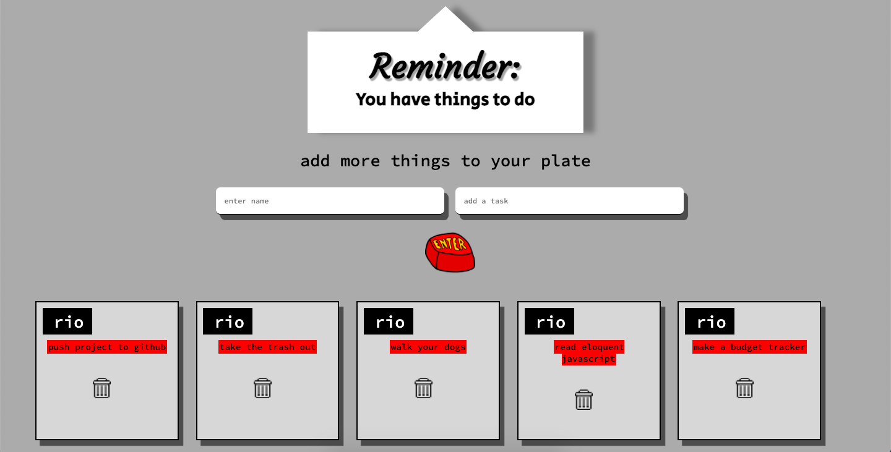

## Goal
Create a fullstack team Tasks-Manager App with User Login. Screenshot is an image of after the user Signs up or Logs in.

## How it's made
Made using HTML, CSS, Javascript, Node.js, JSON, Express, EJS, MongoDB, and User Authentification using passport.
